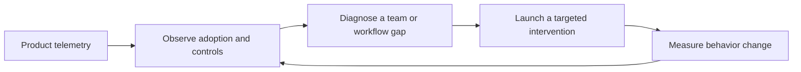
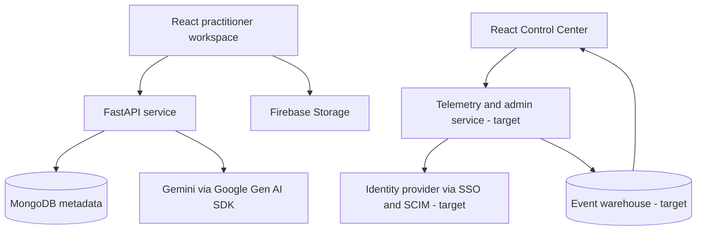

# GCC-SAE

**An enterprise legal-AI workspace with an administration layer for adoption, governance, and measurable value.**

**Live portfolio demo:** [GCC Control Center](https://ggeorge73.github.io/GCC-SAE-Command-Center/)

GCC-SAE started as a cross-border legal advisory and document workspace. This portfolio version adds a second product surface—the **GCC Control Center**—for the people responsible for operating legal AI across a firm or legal department.

The product thesis is simple: provisioning access is not the same as creating value. Enterprise administrators need to know whether teams are adopting AI, whether use is becoming more sophisticated, where governance is exposed, and what intervention to make next.

> **Portfolio disclosure:** GCC-SAE is an independent product concept and is not affiliated with Harvey AI or any law firm. Control Center metrics and identities are synthetic, clearly labeled sample data. No customer or employer information is represented.

## Product surfaces

### 1. Deal Workspace

The existing practitioner experience supports:

- Matter-specific deal rooms across Nigeria, the United States, the United Kingdom, and cross-border transactions
- AI-assisted legal research and advisory conversations
- Document upload, hashing, folder organization, and storage metadata
- Jurisdiction-specific compliance checklists
- Matter-level audit history

### 2. GCC Control Center

The new administrator experience answers four operating questions:

1. **Are people adopting the product?** Weekly active use, adopted seats, practice-group comparisons, and advanced-workflow depth.
2. **Is use governed?** SSO, SCIM, RBAC coverage, access-review exceptions, and policy-covered interactions.
3. **Where is value emerging?** Estimated time returned, high-value practice groups, power-user signals, and underused workflows.
4. **What should an administrator do next?** Evidence-backed activation, governance, and expansion recommendations with accountable owners.

The experience includes:

- Practice-group and reporting-period filters
- Adoption and governance trend charts
- Identity and access review workflows
- Deployment questions with explainable evidence
- Recommended interventions that can be moved into an action state
- CSV export for leadership reporting

## Why this is a product case study—not just a dashboard

The Control Center is structured around an operating loop:



The dashboard is therefore not optimized for the number of charts. It is optimized for the administrator's ability to move from a signal to a defensible action.

## Product decisions

- **Adoption means repeat value, not login activity.** Weekly active use is paired with advanced-workflow depth so passive or shallow usage does not look successful.
- **Governance is shown as exceptions.** Administrators see the identities and workspaces that require attention, not only a compliance score.
- **Recommendations expose their evidence.** Each recommendation names an expected impact and accountable team.
- **Synthetic data is explicit.** A portfolio should demonstrate product logic without implying access to enterprise customer data.
- **The practitioner and administrator experiences remain connected.** The same product can show how workflow events become organization-level signals.

## AI-assisted product development

GCC-SAE was built through an AI-assisted product-development workflow. AI accelerated exploration, implementation, refactoring, documentation, and verification; the product direction, prioritization, metric model, governance boundaries, acceptance criteria, and release decisions were human-led.

The repository preserves its Git history and does not claim that every scaffolded line was handwritten. The portfolio evidence is the ability to turn a broad prototype into a coherent enterprise product, remove proprietary runtime coupling, define trustworthy operating metrics, validate the implementation, and deliver a public release. The complete working method and contribution boundaries are documented in [`docs/AI_ASSISTED_DEVELOPMENT.md`](docs/AI_ASSISTED_DEVELOPMENT.md).

More detail is available in:

- [`docs/PRODUCT_CASE_STUDY.md`](docs/PRODUCT_CASE_STUDY.md) — discovery framing, metric tree, prioritization, and roadmap
- [`docs/DEMO_SCRIPT.md`](docs/DEMO_SCRIPT.md) — a concise hiring-manager walkthrough
- [`docs/SECURITY_AND_GOVERNANCE.md`](docs/SECURITY_AND_GOVERNANCE.md) — current gaps, target controls, and release gates
- [`docs/AI_ASSISTED_DEVELOPMENT.md`](docs/AI_ASSISTED_DEVELOPMENT.md) — development method, contribution boundaries, and verification discipline

## Architecture



The current Control Center uses synthetic in-browser data to make the product model and interactions reviewable without claiming a production telemetry pipeline. The target architecture replaces this dataset with pseudonymized events, identity-provider attributes, and policy decisions.

## Technology

- React 19, Tailwind CSS, shadcn/ui, Recharts
- FastAPI, Pydantic, Motor, MongoDB
- Firebase Storage with MongoDB fallback
- Gemini 2.5 Pro through Google's official Gen AI SDK

## Run locally

### Backend

```bash
cd backend
cp .env.example .env
python -m venv .venv
source .venv/bin/activate   # Windows: .venv\Scripts\activate
pip install -r requirements.txt
uvicorn server:app --reload --port 8001
```

### Frontend

```bash
cd frontend
cp .env.example .env
npm ci --legacy-peer-deps
npm start
```

Open `http://localhost:3000`. The portfolio opens on **Control Center**; the original **Deal workspace** remains available in the header.

## Automated quality gates

Every push and pull request runs two independent checks before a `main` build can be deployed:

- **Backend integration:** starts FastAPI against a disposable MongoDB service and exercises health, deal-room creation, jurisdiction checklists, document upload, advisory fallback behavior, audit history, statistics, and cleanup. CI uses `GCC_SAE_AI_MODE=offline` so the suite is deterministic and does not require a production AI credential. Live Gemini checks remain available with `RUN_LIVE_AI_TESTS=true`.
- **Control Center browser tests:** launches the React application in Chromium and verifies the portfolio disclosure, adoption and timeframe filters, deployment insights, identity search and role filters, recommendation activation, and CSV export.

The GitHub Pages artifact is built and deployed only after both jobs pass. Failed browser runs retain a Playwright HTML report, screenshots, video, and traces for diagnosis.

Run the browser suite locally after installing Chromium:

```bash
cd frontend
npx playwright install chromium
npm run test:e2e
```

Run the backend integration harness against a configured local API:

```bash
GCC_SAE_API_URL=http://127.0.0.1:8001/api python backend_test.py
```

## Current maturity

| Capability | Portfolio state | Production requirement |
|---|---|---|
| Practitioner workspace | Functional prototype | Authentication, authorization, validation, and operational hardening |
| Adoption analytics | Interactive synthetic-data prototype | Versioned event taxonomy and warehouse pipeline |
| Identity administration | Workflow prototype | SAML/OIDC SSO, SCIM, approval policy, and provider-backed mutations |
| Governance coverage | Product model and UI | Policy engine, immutable audit export, alerting, and evidence retention |
| AI deployment insights | Deterministic explainable examples | Governed analytics agent with scoped queries and evaluation suite |
| Automated testing | MongoDB-backed API integration and Chromium workflow suites in CI | Unit-level coverage, accessibility scanning, security tests, and live-model evaluations |

## Success metrics

The Control Center metric tree is designed to prevent vanity-metric optimization:

- **North star:** percentage of licensed users completing a governed, high-value workflow each week
- **Adoption:** activation, weekly retained use, dormant-seat rate
- **Depth:** advanced-workflow usage, repeat matter use, document-grounded interactions
- **Governance:** policy coverage, access-review completion, time to revoke, audit completeness
- **Value:** time returned, cycle-time improvement, administrator reporting effort, enabled-practice expansion

Metric definitions and guardrails are documented in the product case study.

## Roadmap

1. Replace sample analytics with a privacy-preserving event taxonomy and aggregation API.
2. Add an organization/user model with SSO, SCIM, and RBAC enforcement.
3. Turn recommendations into assignable interventions with owners, due dates, and measured outcomes.
4. Add immutable audit export and governance policy coverage at event level.
5. Introduce administrator-created leadership reports and ROI assumptions with provenance.
6. Add evaluation suites for insight accuracy, access-control safety, and metric consistency.

## License and use

This repository is a portfolio prototype. Do not use it to store privileged, confidential, personal, or production legal data in its current form. See the security document before extending or deploying it.
