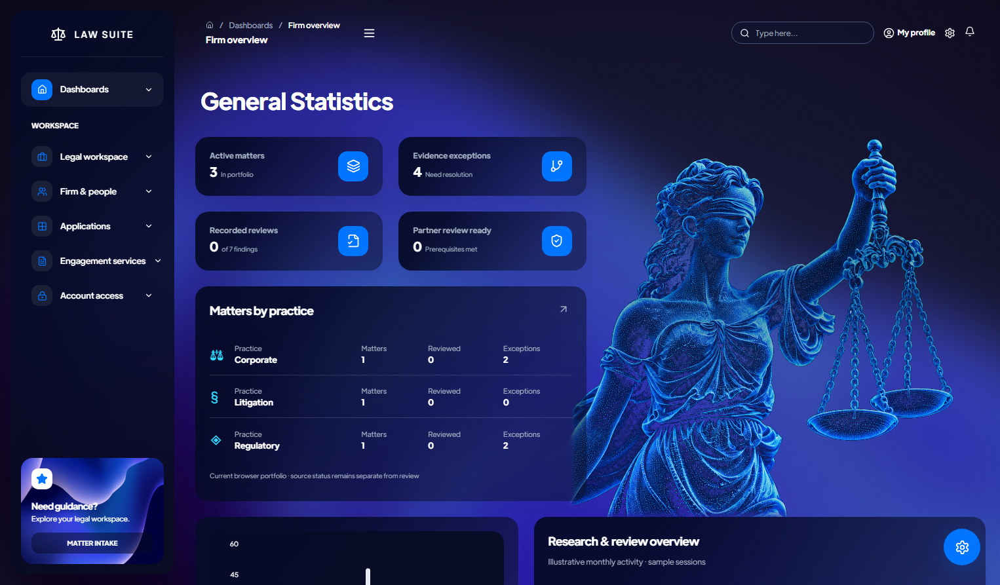

# Lady Justice dashboard artwork

The September 9 update replaces the dashboard globe with Lady Justice, based on the supplied statue image. The existing navy background, blue particle aesthetic, card arrangement, and responsive hero region are retained.

The built-in image-generation tool produced the blue stippled artwork in `frontend/src/assets/vision/lady-justice-particles.png`. `JusticeScene.jsx` renders it on a shallow WebGL relief with an 18-second gentle turn, a nine-second float, and a subtle traveling light variation. This is animated image artwork, not a complete 3D statue or a 360-degree model. The black source background blends away in the renderer; the still fallback uses screen blending.

The renderer caps pixel ratio at 1.5 and updates at approximately 25fps. It pauses offscreen, in hidden tabs, and in inactive windows. Reduced motion produces a still view. Texture loading and unavailable or lost WebGL contexts retain the still artwork. The texture, geometry, material, renderer, listeners, observers, and animation callback are cleaned up on unmount.

## Generation prompt

The initial style transfer used the user's statue as the pose reference: retain the blindfold, face profile, raised arm, balance chains and pans, hair, and drapery; reinterpret the surfaces as fine luminous electric-blue and cyan particles with sculptural depth. The initial transparency output was rejected because it contained a visible checkerboard.

Final edit prompt, used with the built-in image-generation tool:

> Edit this Lady Justice blue particle artwork for a website WebGL texture. Preserve the figure, face, blindfold, hand, raised arm, scales and fine luminous blue particles. Replace the ENTIRE gray-white checkerboard backdrop, including inside the gap under the raised arm and between every scale chain, with uniform pure BLACK #000000. No checkerboard, no gray pixels or patterns in empty space, no watermarks or lettering. This black field is intentional for additive blending; do NOT depict transparency with squares. Fit the entire visible upper-body Lady Justice artwork and both scale pans within a square image with 6% solid black clearance at the top and sides. Keep luminous details electric blue, a little less white/cyan than the input, primarily blue #258aff. Preserve fine stipple particles and dark negative space following the statue's contour. No additional decorative objects. Output a single clean blue Lady Justice on pure black.

## Verification

The production build passed with CI warning enforcement. All five targeted browser scenarios passed: every handoff route at 390px, 768px, and 1526px; visible animation versus reduced-motion stability; offscreen pause/resume; and still fallback when WebGL is unavailable or its context is lost. Desktop, tablet, and phone captures were visually inspected without horizontal overflow.

[Phone layout](design/lady-justice-mobile.png)
