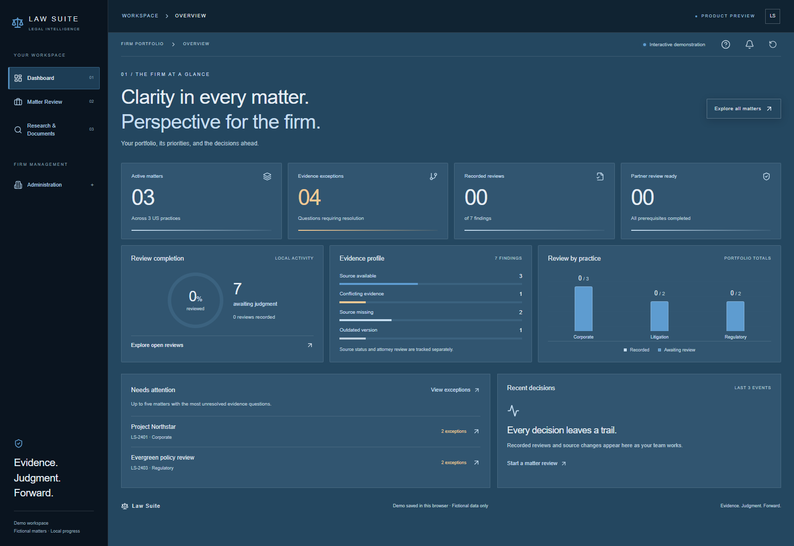

# Law Suite workspace design

This document records the preceding design. The September 8 ZIP handoff supersedes it; see [the current handoff implementation](VISION_HANDOFF.md).

The workspace uses Diamond Echo's homepage typography and restrained visual style, with lighter blue surfaces requested for Law Suite. A persistent dark sidebar and top strip contrast with the full-width steel-blue workspace.

[Matter directory](design/directory.png) · [Research and document library](design/research.png) · [Firm Operations](design/operations.png)

## Typography and palette

The computed styles of [Diamond Echo](https://diamondecho-review.gbengag.chatgpt.site/) were inspected on September 7, 2026: Sora for light display headings, Inter for body copy, uppercase labels with generous tracking, thin borders, and restrained arrow controls. Law Suite uses these same font families and hierarchy at sizes appropriate to an application. Its content remains Law Suite's own.

`frontend/src/theme.css` supplies shared tokens for native controls, Tailwind components, charts, dialogs, and application surfaces. Workspace blues are deliberately lighter than the reference to meet the revised brief.

| Role | Color |
| --- | --- |
| Navigation background | `#0a141f` |
| Recessed workspace | `#1b354b` |
| Workspace background | `#244760` |
| Panel | `#315570` |
| Raised panel | `#3b627f` |
| Bright steel | `#5e9cd0` |
| Soft steel | `#c5ddf0` |
| Primary text | `#e5edf5` |
| Secondary text | `#bdcedc` |
| Exception text | `#f1c994` |

## Navigation and application coverage

- Dashboard is an overview: four aggregate metrics, review completion, evidence distribution, the six largest practices by finding count, at most five matters needing attention, and three recent events. It never renders the full matter directory or workbench. Metric and practice actions open filtered directories; priority matters and recent events open the relevant detail page.
- Matter Review is a dedicated searchable directory with practice and status filters, sorting, matching counts, and 12-row pagination. Search covers matter name, ID, client, and owner. Selected matters open their own review pages. A 500-record browser test exercises this UI; the shipped demonstration still contains three fictional matters. Production-scale retrieval remains a backend requirement.
- Hash routes support direct links, refresh, and browser back/forward on GitHub Pages: `#/dashboard`, `#/matters`, `#/matters/LS-2401/issues`, `#/research`, and `#/operations`. Matter sections include issues, drafts, handoff, activity, and value. Unavailable matter IDs display a recovery action.
- The sidebar remains visible on desktop and becomes a dismissible drawer on phone and tablet. Main pages use available width with narrow content gutters. The matter table scrolls within its container on small screens.
- Evidence inspection, source comparison, drafts, external text intake, handoff requirements, targets, history, value estimates, and dialogs share the typography and lighter surfaces. Review decisions, source dependencies, approval invalidation, exports, and local persistence retain their existing behavior.
- Research & Documents keeps local excerpt search, per-matter sources, source versions, and contextual navigation into draft/review pages. The optional connected prototype and Firm Operations share the theme. Operations retains sample charts, filters, access review, recommendations, and CSV export.

## Verification

Browser regression journeys cover attorney review, source and draft changes, exports, local progress, research, and operations. New journeys cover a 500-matter portfolio, bounded summary rows, pagination, search, filtered drill-down, direct matter URLs, refresh, browser history, unavailable IDs, and directory containment at 390, 768, and 1600 pixels. Research and operations are also exercised on phone, tablet, and desktop. The production build and nine review-logic tests remain required checks.

No database, authenticated identity, legal research provider, or new model integration is introduced. Demo records and progress remain browser-local.
