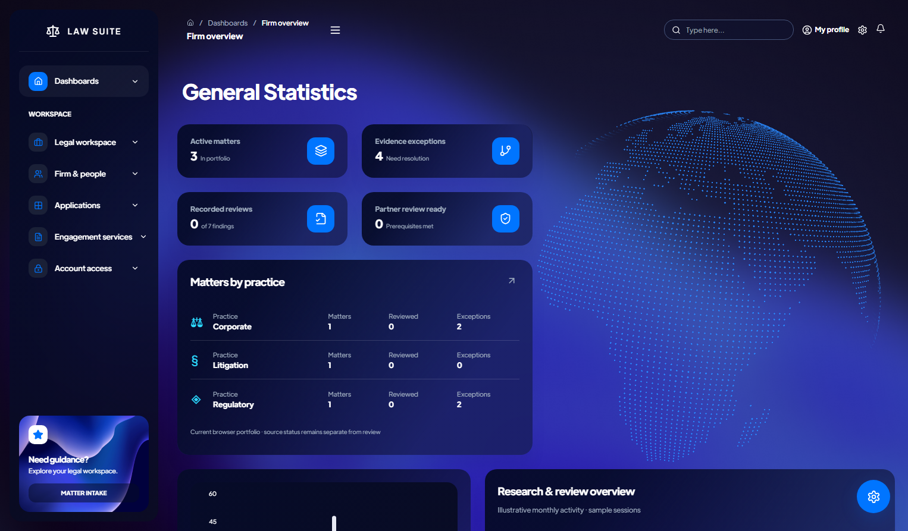

# Vision handoff implementation

This redesign follows `dashboard-designer-builder-handoff.zip`, supplied September 8, 2026. The user confirmed that the full route inventory should be adapted to Law Suite. The new handoff supersedes the preceding Diamond Echo direction.

## Visual system

The application uses Plus Jakarta Display (bundled regular, medium, and bold), the specified #030C1D base, #0075FF electric blue, #2CD9FF cyan, #A0AEC0 labels, 20px glass cards, 22px typical padding, and the captured diagonal translucent gradient. The inset navigation rail is 250px wide with 16px outer clearance. It has expandable groups, compact mode, and a mobile drawer. The right configurator supports five accent colors, transparent/opaque navigation, fixed header, and compact navigation, saved locally.

The Default dashboard preserves the reference composition: two-by-two KPIs on the left, a practice summary below, a large point-cloud globe on the right behind foreground cards, and a narrower reviewer activity panel beside the dual-series research/review chart. Real local matter totals are distinguished from illustrative activity data. The dashboard remains a summary; matter details use the existing directory and review routes.

## Globe implementation

`GlobeScene.jsx` uses a transparent Three.js WebGL renderer and the point data named in the handoff. The dataset contains 13,054 geographic samples in an equirectangular coordinate plane. A single buffer geometry and shader render fine diamond-shaped blue points with orientation-based fading. This is an independent implementation, not the vendor's original globe component.

The current implementation uses an 80-second revolution and a selected axis tilt. These are implementation choices, not measured vendor parameters. Animation uses elapsed time, caps draws at approximately 30fps, caps pixel ratio at 1.5, pauses when hidden, offscreen, or in an inactive window, and renders a still view for reduced motion. The globe and Three.js load separately from the initial application bundle. WebGL initialization/context loss uses a geographic SVG still fallback. Observers, animation callbacks, GPU geometry, materials, and renderer are disposed on unmount.

## Route adaptation

The original hash paths are retained for traceability to the handoff. User-visible names and content are adapted to legal workflows.

| Reference family | Law Suite implementation |
| --- | --- |
| Default / CRM | Firm overview / client relationships |
| Profile / teams / projects | Attorney profile / practice teams / matter portfolios |
| Reports / new user | Team reports / colleague invitation draft |
| Settings / billing / invoice | Local preferences / illustrative firm billing / printable sample statement |
| General / timeline | Engagement overview / matter history and sample milestones |
| Pricing / RTL | Illustrative workspace plans / international desk |
| Widgets / charts / alerts | Practice widgets / firm analytics / local notification center |
| Kanban / wizard / data tables / calendar | Coordination board / matter intake / searchable matter register / internal planning calendar |
| New / edit / view product | Define / edit / view a legal service proposal |
| Order list / detail | Engagement request list / request review |
| Six authentication layouts | Basic, cover, and illustration variants for demo sign-in and account requests |

`routes.js` lists all 32 handoff routes, plus Matter Review, Research & Documents, and Firm Operations. The original evidence review engine remains separate from coordination and planning tasks. Moving a board card or saving an intake does not approve evidence or bypass engagement controls.

## Interaction boundaries

New forms validate required fields and support local drafts. Calendar events, coordination tasks, preferences, and team comments persist in browser storage. Tables search/filter/sort/page; the register exports the currently matching fictional records. Intake supports back/next and final review. Notification examples can be dismissed and restored. Account forms do not store or transmit passwords, create identities, or authenticate users. No message is sent, service published, payment charged, or external calendar updated.

## Reference assets

The ZIP names these resources explicitly; downloaded copies are bundled so runtime rendering does not depend on their hosts:

- Background: https://demos.creative-tim.com/vision-ui-dashboard-pro-react/static/media/body-background.7d7d88a8.png
- Help card: https://demos.creative-tim.com/vision-ui-dashboard-pro-react/static/media/sidenav-card-background.00019e46.png
- Geographic points: https://raw.githubusercontent.com/creativetimofficial/public-assets/master/soft-ui-dashboard-pro/assets/js/points.json
- Plus Jakarta Display: https://cdn.jsdelivr.net/npm/@xz/fonts@1/serve/plus-jakarta-display.min.css

Visual reference and asset attribution: Vision UI Dashboard PRO React, Creative Tim / Simmmple. No licensed PRO component source is included. The existing React stack and Recharts are retained; Three.js is added for the required globe. Commercial rights to vendor assets should be tracked with the project's asset licenses.

## Verification record

The production build passed with CI warning enforcement. All nine review-engine tests passed. All 29 browser scenarios passed against the built, disconnected demo (26 in the initial run; three mobile journeys passed after the navigation helper was corrected to wait for drawer state instead of transitional visibility). The suite visits all 32 handoff routes at 390px, 768px, and 1526px, and covers configurator persistence, intake validation, calendar/board persistence, account-form boundaries, keyboard navigation, WebGL fallback, existing review/source/handoff/export behavior, and the 500-matter directory.

All 32 desktop routes were captured without browser page errors. Visual inspection covered the dashboard, teams, billing, analytics, coordination board, calendar, and account cover layout. The globe was observed at 20-second intervals through its 80-second revolution; reduced-motion captures remained identical. A subsequent phone-spacing correction keeps the globe below the heading. The initial JavaScript bundle is approximately 305 KB compressed, with the globe and renderer in separate chunks. CI integration and deployment checks remain separate from these local results.

[Phone overview](design/vision-mobile.png) · [Practice teams](design/vision-teams.png) · [Legal calendar](design/vision-calendar.png) · [Review board](design/vision-board.png) · [Matter directory](design/vision-matters.png) · [Research](design/vision-research.png) · [Firm Operations](design/vision-operations.png)
